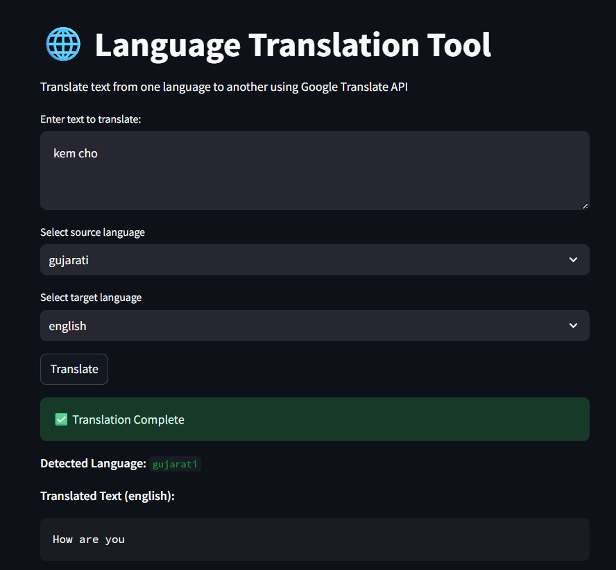
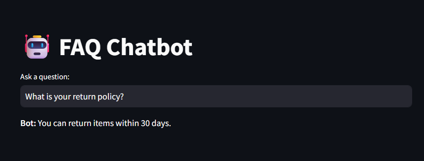

# 🤖 NLP Projects: Language Translator & FAQ Chatbot

Welcome to this repository containing two NLP-based web applications built with Python and Streamlit:

1. 🌐 **Language Translator App** – Real-time multilingual translation using Google Translate.
2. 📚 **FAQ Chatbot App** – AI-powered assistant for answering frequently asked questions.

> Designed for educational, internship, and rapid prototyping use.

---

## 🚀 Project Showcase

| App             | Description                                             | Technologies Used                             |
|----------------|---------------------------------------------------------|-----------------------------------------------|
| 🌐 Translator   | Translate text across 100+ languages instantly          | `streamlit`, `googletrans`, `langcodes`       |
| 📚 Chatbot      | Chat with an AI that answers common product questions  | `streamlit`, `spaCy`, `scikit-learn`, `TF-IDF`|

---
<details>
<summary><strong>Tasks</strong> (click to expand)</summary>

<details>
<summary><strong>🌐 Language Translator App</strong> (click to expand)</summary>

### ✨ Features

- Auto-detect input language
- Translate into 100+ languages
- Clean, responsive Streamlit UI
- Lightweight and fast

### 🧠 How it Works

- Uses `googletrans` to call the unofficial Google Translate service
- Leverages `LANGUAGES` dictionary to convert user-friendly names into language codes
- UI built with `streamlit`

### 🖼️ UI Preview

![Translator App]

### 📦 Installation

```bash
pip install streamlit googletrans==4.0.0-rc1
```
</details>

<details>
<summary><strong>📚 FAQ Chatbot with NLP</strong> (click to expand)</summary>

# 🤖 FAQ Chatbot with NLP (spaCy + Streamlit)

An intelligent chatbot that answers frequently asked questions (FAQs) using NLP techniques such as lemmatization (via spaCy), TF-IDF vectorization, and cosine similarity. Built with Python and Streamlit, this app simulates a simple customer support assistant for any product or service.

---

## 📈 Features

- ✅ Answers user questions based on predefined FAQs
- 🧠 Uses spaCy for lemmatization and text preprocessing
- 📀 Ranks user queries using TF-IDF + cosine similarity
- 🛠️ Easy to extend with new FAQs (edit a single JSON file)
- 💥 Clean, interactive interface built with Streamlit

---

## 📁 Project Structure

```plaintext
faq_chatbot/
├── app.py                  # Streamlit app entry point
├── chatbot/                # Core chatbot logic
│   ├── __init__.py         # Package initializer (optional)
│   ├── core.py             # Matching logic using TF-IDF and cosine similarity
│   └── utils.py            # Text preprocessing using spaCy
├── data/
│   └── faqs.json           # Editable list of FAQs in JSON format
├── requirements.txt        # Required Python packages
└── README.md               # Project documentation
```

---

## 🧠 How It Works

1. User types a question into the chatbot interface.
2. Input is lemmatized using **spaCy**.
3. Each FAQ question is also preprocessed the same way.
4. All are converted to **TF-IDF vectors**.
5. **Cosine similarity** is computed to find the closest match.
6. If the similarity score is above threshold (e.g. `0.3`), the corresponding answer is shown.

---

## 🛎️ Installation

1. **Clone the repository**:

```bash
git clone https://github.com/your-username/faq_chatbot.git
cd faq_chatbot
```

2. **Install dependencies**:

```bash
pip install -r requirements.txt
python -m spacy download en_core_web_sm
```

3. **Run the chatbot**:

```bash
streamlit run app.py
```

---

## 📝 Customizing FAQs

Edit the `data/faqs.json` file to add or update questions and answers:

```json
{
  "What is your return policy?": "You can return items within 30 days.",
  "How can I track my order?": "Track your order with the link emailed after purchase."
}
```
## Ui Interface


</details>
